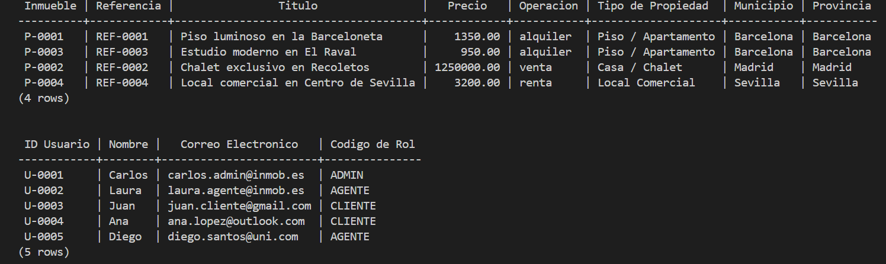
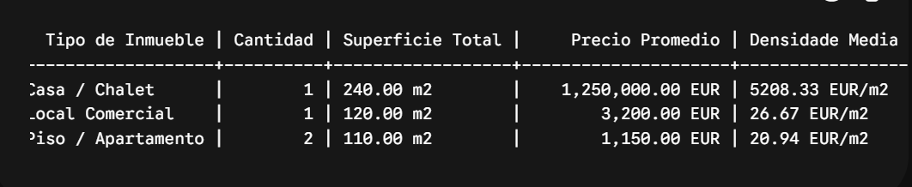

# 🏢 Sistema de Gestión Inmobiliaria (v2.0)

Este repositorio contiene el diseño, modelado e implementación de una base de datos relacional avanzada para una plataforma de gestión inmobiliaria en España. La estructura ha sido optimizada siguiendo patrones corporativos estrictos y requerimientos metodológicos de alta seguridad física y lógica.

---

[]

## 📈 Ventajas Técnicas del Diseño

El diseño actual evoluciona significativamente respecto a los modelos secuenciales tradicionales, incorporando las siguientes ventajas críticas evaluadas en entornos productivos:

1. **Dominios de Datos y Claves Tipadas (`CREATE DOMAIN`):**
   * Las propiedades se identifican con el patrón `P-XXXX`, los usuarios con `U-XXXX` y los mensajes con `M-XXXX`. Esto previene errores de inserción involuntaria de IDs cruzados en la capa de persistencia y facilita la auditoría visual de registros de logs.

2. **Control de Accesos Basado en Roles Estricto (RBAC):**
   * Separación total entre la entidad `usuarios` y los privilegios operativos (`roles`) mediante una tabla intermedia normalizada (`usuario_roles`), permitiendo la asignación dinámica de múltiples perfiles (`ADMIN`, `AGENTE`, `CLIENTE`).

3. **Garantía de Integridad y Robustez Operativa:**
   * **Índices con Funciones (`LOWER`):** Bloquea errores de duplicidad donde e-mails con variaciones de mayúsculas puedan registrarse como cuentas separadas.
   * **Índices Parciales Condicionales:** Optimización de búsquedas mediante índices que solo procesan registros activos (`WHERE deleted_at IS NULL`), acelerando las respuestas del portal público.
   * **Búsqueda por Texto Completo Avanzada:** Integración de la extensión nativa `pg_trgm` con un índice especializado `GIN` sobre los títulos de los inmuebles para soportar búsquedas aproximadas de texto (*fuzzy matching*).

---

[]

## 📁 Estructura del Proyecto

El ecosistema se despliega de forma modular garantizando un pipeline idempotente y limpio:

* **`01_schema.sql`**: Definición de la arquitectura física de datos, creación de esquemas, tipos enumerados (`ENUM`), dominios tipados, tablas con restricciones complejas e índices de alta velocidad.
* **`02_seed.sql`**: Script de carga inicial masiva de datos normalizados que simulan un entorno real en ciudades clave como Barcelona, Madrid y Sevilla.
* **`03_queries.sql`**: Consultas analíticas de negocio complejas de alto rendimiento (auditoría RBAC, reportes públicos, cálculo dinámico del coste medio por metro cuadrado e histogramas de superficie).

---

## ⚙️ Instrucciones de Despliegue Automatizado

Para limpiar, estructurar y poblar la base de datos de manera secuencial desde su consola de PowerShell, ejecute el siguiente bloque de comandos:

```powershell
# 1. Configurar la codificación de la consola a UTF-8
[Console]::OutputEncoding = [System.Text.Encoding]::UTF8

# 2. Crear la arquitectura y aplicar restricciones del esquema
& "C:\Program Files\PostgreSQL\18\bin\psql.exe" -U postgres -p 5434 -d inmobiliaria_db -f 01_schema.sql

# 3. Poblar el entorno de datos e interacciones analíticas
& "C:\Program Files\PostgreSQL\18\bin\psql.exe" -U postgres -p 5434 -d inmobiliaria_db -f 02_seed.sql

# 4. Lanzar el panel analítico y auditorías de datos
& "C:\Program Files\PostgreSQL\18\bin\psql.exe" -U postgres -p 5434 -d inmobiliaria_db -f 03_queries.sql